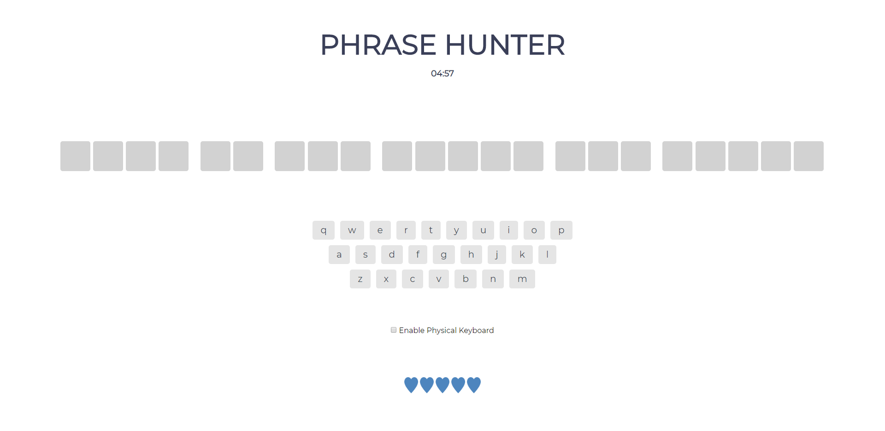

# **OOP Phrase Hunter Game**
This is a simple game that makes the player guess the correct letters in the phrase. The game will end once the player successfully guess all the letters in the phrase or loses the game.

## **Documentation**
**Structure**

This game uses JavaScript, CSS, and HTML as it's core and a little PHP to fetch the JSON data on the third party website (_see reference for more details_) used in making this game.

**Objective**

The player needs to figure out all the correct letters of the phrase to win. Player will lose once all the five hearts is consumed or the player run out of time. 

**Controls**
 * **On Screen Keyboard** - Players can use the the on screen keyboard for the game. This feature was built so not only desktop users can enjoy the game, _but also for mobile users_.

 * **Physical Keyboad** - Players can also use their own peripheral devices in playing this game. It work just like the onscreen keyboard and it's rule. _player cannot guess the same letter and only does not accepts non-letter character as player input_

**Game mode**

The player can choose the level of difficulty of the game, Easy, Normal and Hard. 

---
**Reference**

[Phrase Generator](https://www.thegamegal.com/word-generator/ "The Game Gal") 
this game uses a third party website for generating phrases.

**Author**

This game was programmed by [Raven Aquino](https://github.com/synra-dev/)
